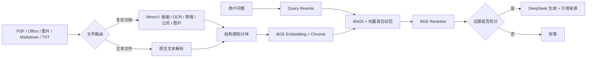

# Multimodal Doc RAG

面向政企知识库场景的多模态文档解析与可追溯 RAG 问答系统。

[](https://github.com/guoyixuan1994-2025/multimodal-doc-rag/actions/workflows/ci.yml)


它不是一次简单的“文档切块 + 调用大模型”。系统针对 PDF、扫描件、Office、图片和文本设计了差异化解析链路，并完整实现混合召回、重排、拒答、引用、持久化知识库和离线评估。

## 项目亮点

- **真实多模态解析**：MinerU 处理版面、OCR、表格、公式与图片描述，文本文件走轻量原生解析。
- **完整检索链路**：Query Rewrite + BM25 + 向量混合召回 + BGE Reranker。
- **可追溯与可拒答**：回答返回原文 chunk、文件名和分数；资料不足时拒绝编造。
- **长期知识库**：Chroma 持久化、增量更新、同名文档稳定覆盖、collection 隔离。
- **工程化任务管理**：重型解析任务支持状态轮询、取消和串行资源保护。
- **可量化评估**：输出 Hit、Precision@K、Recall@K、MRR 和 RAGAS 指标图表。
- **双交互入口**：FastAPI/OpenAPI 适合系统集成，Streamlit 适合现场演示。

## 系统架构



## 技术栈

| 层次 | 技术 |
| --- | --- |
| API / UI | FastAPI、Streamlit、原生 Web Demo |
| 文档解析 | MinerU、PyPDF |
| 检索 | BM25、BGE Embedding、Chroma |
| 重排 | `BAAI/bge-reranker-v2-m3` |
| 生成 | DeepSeek OpenAI-compatible API |
| 评估 | RAGAS、Pandas、Matplotlib |
| 部署 | Docker、Docker Compose、GitHub Actions |

## 快速启动

### Docker Compose

准备条件：

- Docker Desktop 已启动
- Docker 可用内存建议不少于 `8 GB`
- 建议至少预留 `20 GB` 磁盘空间
- 可用的 DeepSeek API Key

首次部署会构建完整 MinerU 镜像，并下载 embedding 与 reranker 模型。根据网络速度，首次构建通常需要
`20-30` 分钟，首次问答还可能需要 `3-8` 分钟进行模型下载和预热；后续启动和问答会复用 Docker 镜像与模型卷。

```bash
cp .env.docker.example .env.docker
# 编辑 .env.docker，填入 LLM_API_KEY，并替换 APP_API_KEY
docker compose up --build -d
docker compose ps
```

Windows PowerShell：

```powershell
Copy-Item .env.docker.example .env.docker
# 编辑 .env.docker，填入 LLM_API_KEY，并替换 APP_API_KEY
docker compose up --build -d
docker compose ps
```

启动后访问：

- Streamlit 控制台：<http://localhost:8501>
- FastAPI Web Demo：<http://localhost:8090/web>
- OpenAPI 文档：<http://localhost:8090/docs>

首次启动建议观察 API 日志，等待模型下载与健康检查完成：

```bash
docker compose logs -f rag-api
```

当 `docker compose ps` 中 `rag-api` 显示 `healthy` 后，打开 Streamlit 控制台，填写 `.env.docker`
中的 `APP_API_KEY`，初始化样例知识库并开始提问。页面中不要填写 `LLM_API_KEY`。

常用运维命令：

```bash
docker compose stop          # 停止服务，保留模型和知识库数据
docker compose start         # 复用缓存快速启动
docker compose down          # 删除容器，保留具名数据卷
docker compose down -v       # 同时删除模型缓存和知识库数据
```

如果首次构建提示无法访问 `auth.docker.io`，通常是 Docker Hub 临时网络问题，可以先执行：

```bash
docker pull python:3.11-slim
docker compose up --build -d
```

### 本地 Python

```bash
python -m venv .venv
# Windows: .venv\Scripts\activate
# Linux/macOS: source .venv/bin/activate
pip install -r requirements.txt
pip install "mineru[core]"
cp .env.example .env
python -m uvicorn app.main:app --host 127.0.0.1 --port 8090
```

另开终端启动控制台：

```bash
python -m streamlit run streamlit_app.py
```

## 推荐演示路径

1. 初始化样例知识库，展示 Markdown/TXT 快速入库。
2. 上传扫描 PDF，展示 OCR 和异步解析任务进度。
3. 提问“为什么要用 BM25 和向量混合检索？”，展示答案、引用和分数。
4. 提问资料中不存在的问题，展示拒答能力。
5. 运行评估，展示检索指标和 RAGAS 图表。


## 核心 API

| 接口 | 用途 |
| --- | --- |
| `POST /documents/upload` | 上传文档 |
| `POST /documents/parse-jobs` | 创建异步解析入库任务 |
| `GET /documents/parse-jobs/{job_id}` | 查询任务进度 |
| `POST /documents/parse-jobs/{job_id}/cancel` | 取消解析任务 |
| `POST /documents/ingest-directory` | 批量构建或增量更新知识库 |
| `POST /chat` | 可追溯问答 |
| `POST /chat/stream` | SSE 流式问答 |
| `POST /eval/run` | 运行评估并生成图表 |

## 关键设计取舍

### 为什么采用混合检索？

向量检索擅长语义相似，BM25 擅长精确实体、缩写和专业术语。两者混合后再通过 reranker 精排，可以兼顾召回率与最终相关性。

### 如何减少幻觉？

系统在生成前判断证据是否充分；回答只基于召回片段生成，并返回引用来源。资料不足时明确拒答，而不是让 LLM 自由补全。

### 如何处理多文档串答？

知识库按 collection 隔离；问题显式包含文件名时，检索范围自动限制到对应文档。同名文档更新时使用稳定 `doc_id` 覆盖旧 chunk。

### 为什么解析任务支持取消？

MinerU 的 OCR 和视觉分析可能持续较长时间。系统将解析封装为可轮询任务，并在取消时终止子进程，避免长任务持续占用 CPU/GPU。

## 评估

```bash
python run_dev.py
python run_eval.py
```

评估会生成：

- 检索指标：Hit、Precision@K、Recall@K、MRR
- RAGAS 离线与在线指标
- CSV 明细与 Matplotlib 图表

## 项目结构

```text
app/
  parsers/       # 文件路由与 MinerU/文本解析
  chunking/      # Markdown 与递归分块
  indexing/      # Embedding、BM25、Chroma
  retrieval/     # Query rewrite、混合召回、重排
  generation/    # LLM、Prompt、拒答策略
  services/      # 文档、任务、RAG、评估服务
  api/           # Web 路由
sample_docs/     # 公开或自制演示资料
web_demo/        # 轻量 Web 页面
streamlit_app.py # 面试演示控制台
```

## 生产化边界

当前版本定位为可运行的工程能力展示项目。用于公网生产环境前，还需要补充对象存储、任务队列、数据库状态管理、租户隔离、上传配额、限流、监控告警和 HTTPS 网关。安全注意事项见 [SECURITY.md](SECURITY.md)。

## License

MIT
